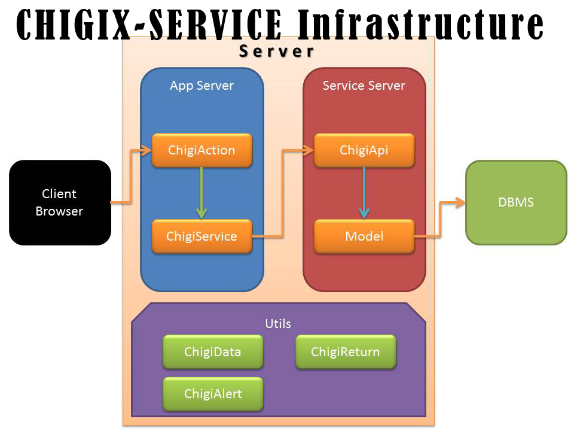

千木服务架构
=======================

For ThinkPHP 3.1.0 +

Version 1.7.0

Author 千木郷（李颖豪） chigix@zoho.com

Facebook: http://facebook.com/chigix

Weibo: http://weibo.com/chigix

# CONTENTS

- [Introduction](#introduction)
	- [About Version](#about-version)
	- [License](#license)
- [Overview](#overview)
- [Getting Started](#getting-started)
	- [Installation](#installation)
		- [控制器部署](#-1)
		- [模型部署](#-2)
		- [模板部署](#-3)
		- [Widget部署](#widget)
		- [URL部署](#url)
	- [上线部署](#-4)
- [开发规范](#-5)
	- [返回值统一规范](#-6)
	- [表单提交规范](#-7)
		- [公共接收接口规范：](#-8)
		- [自定义接收接口规范：](#-9)
	- [GET地址传参统一规范](#get)
	- [POST、REQUEST传参统一规范](#postrequest)
	- [under机制规范](#under)
	- [CHING-SESSION会话机制](#ching-session)
		- [CHING会话部署 与 参数配置](#ching--)
		- [ching()函数使用](#ching)
		- [CHING会话初始化](#ching-1)
		- [CHING会话服务注册](#ching-2)
		- [关于操作时效](#-10)
	- [模板变量assign命名规范](#assign)
- [API——ChigiAction](#apichigiaction)
	- [$this->on($serviceName = null, $methodName = null, $successDirect = null, $errorDirect = null);](#this-onservicename--null-methodname--null-successdirect--null-errordirect--null)
- [API——ChigiApi](#apichigiapi)
	- [$this->appHost;](#this-apphost)
	- [$this->appHostIp;](#this-apphostip)
	- [$this->time;](#this-time)
	- [$this->dm("TableName");](#this-dmtablename)
- [API——ChigiService](#apichigiservice)
	- [$this->apiAction;](#this-apiaction)
	- [$this->cookie_status = 1;](#this-cookie_status--1)
	- [$this->addAddrParams( string $key, mixed $value);](#this-addaddrparams-string-key-mixed-value)
	- [$this->successDirectHeader();](#this-successdirectheader)
	- [$this->errorDirectHeader();](#this-errordirectheader)
	- [$this->setDirect( string $successAdd = null, string $errorAdd = null);](#this-setdirect-string-successadd--null-string-erroradd--null)
	- [$this->under($method);](#this-undermethod)
- [工具函数系列](#-11)
	- [string arrayImplode( string $glue, string $separator, array $array);](#string-arrayimplode-string-glue-string-separator-array-array)
	- [void redirectHeader($addr, $params = array());](#void-redirectheaderaddr-params--array)
	- [string redirect_link($addr, $params = array());](#string-redirect_linkaddr-params--array)
- [ChigiCode](#chigicode)
	- [第一位数说明](#-12)
	- [第二位数说明](#-13)
	- [第三位数说明](#-14)
	- [具体代码说明](#-15)

# Introduction

本架构旨在为业务逻辑层，构建一个快速敏捷的开发模式，使得常用逻辑服务化封装，并直接可拼装，解放代码与数据库设计。

同时高度分离逻辑处理与界面输出，彻底提升开发者代码的可移植性，借助于架构的服务层抽象，可以轻松地剥离出具有可移植性的代码，从而简化逻辑层的代码量与复杂度。

在架构设计上是基于经典的MVC架构进行一定的演变，使框架结构化的开发更加灵活与轻便，以松耦合、高内聚作为开发整体思想。

MVC架构是在软件开发中已占据不可动摇的地位，其架构模式的经典性与效力性无可质疑，而现在亦有大量优秀的成型的MVC框架，所以本架构不希望重复制造已存在的轮子，MVC架构使用现有的已足够。而本架构是基于MVC模式之上，提供一个项目部署与开发的整体方案——服务化方案。使得开发者不需再拘泥于MVC架构，更无需为架构而架构，一切的讨论与开发都由服务而来，一切的资源亦都是服务，有点类似于云计算中的一切皆服务思想（XaaS）。

## About Version

现本架构尚于起步阶段，1.0版本定位于拥有完整的服务体系架构，可实现在服务体系下模块与模块间接交互，并尽可能多地开发基本服务，以使基于本架构能更便捷地开发出流行的web应用。

1.0版核心点还是在于单体应用的开发，而不在大规模集群和分布式应用的开发。

2.0版本的主要路线是开始由单体应用框架开始转移向集群分布式系统的定位，主要任务是提供暴露于外部WEB网络下的API接口，以实现模块与模块之间的分布式通信。

## License

本项目遵循 **Apache2开源协议** 发布。Apache License是著名的非盈利开源组织 Apache 采用的协议。该协议和 BSD 类似，鼓励代码共享和尊重原作者的著作权，同样允许代码修改，再作为 **开源或商业软件** 发布。需要满足如下条件：

1. 需要给代码的用户一份 Apache License
2. 如果你修改了代码，需要在被修改的文件中说明
3. 在延伸的代码中（修改和有源代码衍生的代码中）需要带有原来代码中的协议、商标、专利声明和其他原来作者规定需要包含的说明
4. 如果再发布的产品中包含一个 Notice 文件，则在 Notice 文件中需要带有 Apache License 。当然允许第三方在 Notice 中增加自己的许可，但不可以表现为对 Apache License 构成更改。

具体的协议参考：http://www.apache.org/licenses/LICENSE-2.0 

# Overview

通过本项目，开发者可以有一种更灵活更轻便的方式来部署和使用MVC架构，而开发在本架构中亦可进行如下两种开发：

1.	服务开发

	由于本框架是将所有的分层、架构均归为一个服务，所以架构本身只是一个解决方案，而部署具体的业务逻辑、开源业务逻辑则只需要将业务逻辑、应用逻辑本身当作服务来开发即可，而服务的作用就是实现系统的模块化拼装，服务与服务之间完全无依赖，在服务内只完成属于服务自己的业务逻辑和应用逻辑，而搭建的系统则是为服务之间建立起依赖关系。

2.	应用开发

	其实就是开发一个具体的项目，具体的系统，而基于服务架构的开发，只需要将自己系统所需的几个服务进行一下依赖的定义，完成服务组装，即可完成一套大型系统的开发项目。

本项目中已重构了框架中原生的Action控制器类，并为调试期间的工作提供了为本架构服务的模板引擎，虽然不会影响实际部署时的实现，但是毕竟是专为调试期间提供的服务，所以在部署模式时建议切换回ThinkPHP原生模式。

本架构仅仅是一个MVC开发的部署方案，也就说本质仍旧是依赖于原生的MVC框架，所以在千木服务架构与MVC架构之间是无缝切换的。而千木服务更大程度上是从调试阶段来考虑的。实际部署时，若不切换回原始的MVC框架，会有一定的性能影响。

# Getting Started

所有的源代码资源可参考sample目录下的文件，可以直接复制，参照里面的注释和格式进行修改即可。

1.7.0版本开始，前端渲染增强已完全集成入千木服务架构（低版本中依赖于千路前端服务ChijiService），所有的开发更加接近原生的ThinkPHP的书写规范，使开发者在ThinkPHP的原生环境下，无需对业务逻辑代码进行任何的调整与修改即可平滑过渡进入千木服务架构平台之上。并且可以直接连接基于本架构所开发的各种强劲的服务，以简化业务逻辑的开发与模块拼装。

在控制器中，前端渲染增强可以说是本架构的一大亮点，将WEB开发中一个一直以来都非常头痛的问题当作一个服务来解决，开发者在前端与后端之间的对接通道仍保留 `$this->display()` 不变，本架构会自动为开发者安排好所有的前端资源部署，而开发者在前端调用时，所有的资源只需从目录：`webRoot\Chiji\ProjectName\` 中获取即可。

在控制器中需要连接服务才能使用目标服务提供的方法和业务逻辑，而开发者几乎什么都不用做就可以开发出一个具有规模的系统。

连接服务亦非常简单，只需一句 `service("ServiceName")` ，从1.7.0开始服务的连接单例化，故开发者可以随意调用service函数而无需担心服务类的内存开销。

**所有的service只能在客户端应用及客户端service中使用，不能在服务端Api及Model中使用。**

## Installation

本架构实为MVC框架的一个扩展机制，所以安装本架构就变得十分简单。本版本仅可用于ThinkPHP 3.1.0以上版本，对于符合版本要求的THinkPHP项目可以直接迁移到千木架构之上，而对于低于该版本要求的ThinkPHP 项目，请根据ThinkPHP自带的升级指南，将项目代码修改至兼容版本后，亦可平滑过渡到本架构之上。

直接在系统扩展目录（默认为webRoot/ThinkPHP/Extend/）下新建一个文件夹并命名为 `Chigi` ，直接将本仓库中的所有内容全部托入该文件夹中，即完成千木服务扩展的安装。

若要使用千木服务架构来设计应用，仅需在项目的别名配置（alias.php）中加入如下两行即可（可直接拷贝，无需改动）：

		require(EXTEND_PATH . 'Chigi/alias.php');
		return chigi_alias();

由于从1.7.0开始，架构内部完全集成前端渲染增强，故需要再安装前端渲染增强插件，可以在Samples/ORG/下找到Chiji目录，将该目录直接复制到ThinkPHP的扩展ORG目录下即可。该扩展包中集成了phpLess和JSxs，可与千木架构完美配合。

至此整个项目便可以完全使用千木服务架构来进行开发。

千木架构在ThinkPHP上的安装基于alias别名控制文件，但是不影响开发者定义自己的别名文件，该函数中支持直接放入数组：

		return chigi_alias(
			'Content' => EXTEND_PATH . 'Example/Content.class.php',
			'Comment' => EXTEND_PATH . 'Example/Comment.class.php',
			'User' => EXTEND_PATH . 'Example/User.class.php',
			);
		//↓上面的别名定义与原生架构完美兼容：
		import('Content');
		$obj = new Content();  //与ThinkPHP自身的用法无区别★

### 控制器部署

1.	IndexAction	——首页
2.	.....Action ——其他页面，一个页面就一个控制器，且直接使用index方法，或可在控制器内跳转修改index。
3.	AjaxAction	——ajax模块，主负责所有页面上异步交互的执行操作

### 模型部署

由于一切业务逻辑均服务化，所以对于一些主要的业务逻辑均已封装于已有的服务中，而对于已有服务提供的模型则无需作任何部署，直接连接到对应的Service类即可，在千木服务化架构下会替开发者完成所有本服务下的业务逻辑。

### 模板部署

由于在千木架构下，所有的模板都是直接采用与当前控制器及操作一一对应，故在控制器中只需 `$this->display()` 即可完成前端的输出，而不用开发者再作其他的工作。当然，这需要一个非常严格的模板目录部署机制，以做到 `display` 方法输出时可以直接定位及渲染模板。

从1.7版本开始，调试模式下集成前端渲染增强，每个页面均由一个主页面渲染入口及一堆模块页面组成，在主页面中声明需要加载的子页面，千木架构会自动进行块状加载及渲染，并通过ThinkTemplate模板引擎进行编译，以支持部署模式下的ThinkTemplate模板编译缓存的高效性。

模板目录Tpl下的文件部署如下：

		|-Tpl/Default               主题目录
		|        ├Index/            Index控制器下的页面渲染入口（即主模板文件）
		|        	├index.html     index页面主模板文件
		|        	├method.html    其他页面主模板文件
		|        ├IndexMODULE/            Index控制器下的模块页面（供块状渲染）
		|        	├indexStarter.html     index页面初始模块
		|        	├pageLoginForm.html    page页面的登录表单
		|        ├Public    公用模板文件
		|        ├Utils     可移植服务接口模板文件
		|

### Widget部署

		|-Widget/				Widget扩展目录
		|     ├DemoServiceWidget.class.php    DemoService对应Widget类
		|     ├DemoService/                   DemoService对应Widget类调用模板目录
		|              ├method1.html          Widget类下method1操作对应模板文件
		|              ├demoMethod.html       DemoServiceWidget类下的demoMethod操作对应模板文件
		|     ├OtherServiceWidget.class.php   其他同样型的Widget类部署
		|

### URL部署

从千木服务架构1.5.0起，提供全局URL跳转机制，方便连接多站以轻松组建站群。

只需将需要整合在一起的网站共同连接到同一URL跳转池中即可在。

而现1.5.0中的URL跳转池是创建在数据库中的，ChigiAction会自动连接该数据库并进行跳转检测，从而实现全局统一页面跳转。

而开发者使用该功能则必须保证已定义的全局页面仅能存在一个项目中，不能出现多个项目共有，否则会出现非全局跳转。

而对于已有项目的页面重名问题，例如index操作，则可以在操作名前加两个下划线，以避开重名。

## 上线部署

App目录部署如下：

		|-Core/
		|-App/
		|   |-Common/
		|   |-Conf/
		|   |-Lang/
		|   |-Lib/
		|   |-Runtime/
		|   |-Tpl/
		|   |-.htaccess  ——直接将域名指向到App目录中，不同级别的域名则部署方式相同，无需改动PHP
		|   |-index.php  ——因为作为根目录，所以入口文件放置于目标域名的根目录下
		|
		...
		...
		|-Chiji/   ——建议直接建一个新域名指向该目录，所有静态资源文件均通过该域名来获取
		|    |-App/
		|    |   |-img/
		|    |   |-css/
		|    |   |-js/
		|    |
		|    |-Img/  ——作为图片服务的资源管理仓库
		|
		|

[返回目录](#contents)

# 开发规范

## 返回值统一规范

在千木架构中，建议所有的方法或函数返回值均采用数组，示例格式如下：

		$return = array(
			'status' => 220,
			'info' => "获取文章id=13成功",
			'data' => array(
				"title" => "示例标题",
				"content" => "此处示例内容",
			),
		);

建议返回值格式须由 `status` 、 `info` 、`data` 三个元素组成：

1.	status：返回值的操作码，一个3位数的INT值，一切要包含的意义尽在这三位数中。
2.	info：返回官方型的返回信息，供调用本函数的开发者看，可以写一些建议，也可以写操作状态，是一个字符串。
3.	data：真正要返回的实体数据，即整个函数真正要返回的内容在这里

采用建议的返回值规范格式可以很方便地通过返回值处理服务ReturnService来接收返回值并进行智能处理和包装，方便开发与模块间开发的规范统一。提升开发体验。

关于status操作码，可参考最后所附的ChigiCode。

[返回目录](#contents)

## 表单提交规范

表单能让服务器接收来自客户端的大量复杂数据，为保证服务器的安全性，需要对表单提交进行多重安全检测过滤。

对于表单提交，从1.5.5版本开始，千木服务架构专门提供了一个on万能操作，用于接收所有的表单数据并送至指定服务类进行处理和输出跳转。

通过on操作可以避开数据处理和结果输出之间的耦合，而关于on操作的使用则有如下两种接口方案：

1. 公共接收接口：on操作直接暴露在HTTP下接收提交过来的表单，通过通用表单接收规范，千木架构会自动将数据送至对应服务类。
2. 自定义接收接口：在控制器中定义表单的接收方法，手动调用on操作来指定目标服务类。

以上两种方法仅仅是on操作的调用方式不同，而on操作本身就是负责将数据送至服务类进行处理，数据存储和业务逻辑当然则是由Api基于数据模型完成，而数据处理完毕后的输出与跳转机制则是定义在服务类中。

on操作与under操作的逻辑部分均由相应的服务类提供，而on操作应用层封装于控制器层，可通过在控制器中包装调用或直接接收外部表单HTTP提交；而under操作封装于Service类，通过在控制器中进行环境检测（undercheck）调用。

从1.5.5开始，服务类不再允许暴露于HTTP下，而改由on操作包装调用，目标服务类的指定均通过给on操作传参完成，而两种不同的接收接口则对应两种不同的传参方式，提升开发体验。

从1.7.0开始，服务类不再允许通过HTTP访问。

### 公共接收接口规范：

表单直接提交至 `{:redirect_link('/on/',array('iframe'=>$_GET['iframe']))}` 即可，无需做任何变动。

控制器中在输出表单的操作中定义ching内容，on操作会自动处理ching会话：

1. 控制器中

		//设置成功跳转地址↓
		ching("CHIGI_SUCCESSDIRECT", '/profile/');

		//设置失败跳转地址↓
        ching("CHIGI_ERRORDIRECT", '/login/');

        //设置表单"CHIGI_TAG"目标数组
        ching("CHIGI_TAG",array(
			"SERVICE" => "Sugar",  //指定向Sugar服务
			"METHOD" => "login"
		));

2. 表单设计上

		<!-- 目标跳转地址，一般与成功跳转地址相同 -->
		<input type="hidden" name="iframe" value="/index.php/profile">

		<!-- 表单令牌 -->
		<input type="hidden" name="__hash__" value="970e9c4e7b4ce03d57694536a82b46a0_11dbf80f6813d6b4b024f27346dff35b">

		<!-- 表单验证码（可选） -->
		<input type="text" name="verify" value="">
		

公用表单接收操作方案主要是减免自定义表单接收操作的定义，提升开发体验。但是相应地就有一定的弊端，因为调用服务类所用的传参方式完全基于ching会话，所以采用on操作会存在超时问题。

根据千木架构的底层定义，一旦操作超时，系统会自动跳回上一页面，并提示“操作超时”。该时效即ching会话配置 `CHINGSET.EXPIRE` 中定义的时间。

[返回目录](#contents)

### 自定义接收接口规范：

表单提交地址为： `{:redirect_link('/onxxx/',array('iframe'=>$_GET['iframe']))}` ，对应在Index控制器中定义的 `onxxx` 操作。

控制器中操作定义：必须以on开头：

		public function onxxx(){
			$serviceName = "Article";
			$methodName = "add";
			$successDirect = '/profile/';
			$errorDirect = '/login/';
			//手动调用on方法
			return($this->on($serviceName,$methodName,$successDirect,$errorDirect));
		}

服务类中定义：必须以on开头：

		public function onTest(){
			if(DEBUG) return -1;
			if(FALSE) return 0;
			if(TRUE) return 1;

			//↓直接返回ReturnService对象
			return service("Return")->get(...);

			//↓支持返回Return规范数组
			return array(
					"status" => 201,
					"info" => "BANKAI"
				);
		}

由于这种手动传参调用的方式不依赖ching会话，所以服务器的资源开销会小一些，同时不存在表单提交的时效问题，可以应用在文章提交之类的表单页需要长时间停留的业务上。

## GET地址传参统一规范

所有参数均基于PATH-INFO，且均以标准的 `key/value` 型书写，其中key则直接可从 `$_GET` 中获取，而部分value需经过 `base64_encode` 函数加密写入，获取时由 `base64_decode` 函数解密使用。（仅有本架构占用的一些特殊的GET变量需要进行如上转换，不影响开发者的一般使用）

建议使用架构自提供的 `redirectHeader()` `redirect_link()` 和继承ChigiService的服务子类中的 `addAddrParams()` 方法来自动生成URL。

本架构默认占用的GET变量名：

1. $_GET['iframe']，全局化的GET变量，如果地址栏中没有设定，则会在架构中自动补充为NULL

而获取时ChigiAction根类已自动将所有的$_GET参数（除ThinkPHP的URL索引外）全部进行了 `base64_decode` 解码。

## POST、REQUEST传参统一规范

POST认为是来自表单的参数传递，故所有的POST请求中均需有表单令牌验证。

REQUEST由于包含了GET的信息，但却不与GET一起统一进行BASE64的解密，所以不建议使用REQUEST。

## under机制规范

under机制就是一种业务级的环境保障，即先手动检测当前环境是否符合要求，若不符合则跳转到一个新的页面，若符合则往下执行。

而在本架构中，从1.6开始由服务类开始提供under操作，多种服务类之间可以拼装，环境检测亦可以拼装，不同的环境检测由不同的服务类提供调用，增加开发体验。

开发上，控制器中通过 `under` 操作调用，服务类中则提供对应的以 `under` 开头的方法。

通过调用根类提供的under()操作，直接便捷地执行对应服务类中的环境检测逻辑：

**控制器中**：

		$serviceSugar->under('Login')->setDirect('/login/')->pushAlert("对不起，请先登录")->check();

则在SugarService **服务类中** 有对应的 `underLogin()` 方法以封装检测逻辑，支持Integer、Boolean、Array三种返回类型：

		/**
		 * @return integer
		 */
		public function underLogin(){
			return isset(ching("uid"))? 1 : 0;
		}

		/**
		 * @return boolean
		 */
		public function underLogin(){
			return isset(ching("uid"))? true : false;
		}

		/**
		 * @return array 需符合本架构的返回值规范
		 */
		public function underLogin(){
			if(isset(ching("uid"))){
				return array(
					"status" => 201,
					"info" => "LOGINED"
				);
			}else{
				return array(
					"status" => 401,
					"info" => "UNLOGINED"
				);
			}
		}

on操作与under操作的逻辑部分均由相应的服务类提供，而on操作应用层封装于控制器层，可通过在控制器中包装调用或直接接收外部表单HTTP提交；而under操作封装于Service类，通过在控制器中进行环境检测（undercheck）调用。

[返回目录](#contents)

## CHING-SESSION会话机制

从1.2版本开始，提供CHING会话机制，该会话机制旨在分布式的会话实现，并作为原生SESSION机制的增强替代方案。

CHING会话机制提供开发者与SESSION几乎完全一样的使用方法，但是其内部的实现机制上直接提供了跨子域、无COOKIE跨页、多站会话共享等问题的解决。

现1.7.0+版本中的CHING会话机制物理实现上仅处于物理文件读写、APC、Xcache，Memcache等其他缓存支持将在2.0+版本中提供支持。

### CHING会话部署 与 参数配置

		/WebRoot/Core/  ——放置MVC框架内核
				/Ching/ ——放置CHING会话文件

一般网站按上述部署即可，在config.php中加入下面的设置项

		'CHINGSET' => array(
				'TYPE' => 'File',     //底层缓存方式
				'DIR' => dirname($_SERVER['SCRIPT_FILENAME']) . '/' . THINK_PATH . '../Ching/',  //缓存目录（仅针对File缓存方式有效）
				'EXPIRE' => 60,      //缓存时效，超时该缓存中的内容将不可读，并且尝试读取的操作将返回false
				'DOMAIN' => "five.com", //设置ching会话SID的作用域名
		);

SID是CHING会话的暴露标识，用以让浏览器在页面切换之间可以继续上一页面的访问情况，关于SID则比session_id更加灵活与安全，SID可以通过COOKIE、GET、POST三种方式传递给服务器，为了安全起见，可以直接将CHING会话与用户挂钩。

从1.2.1版本开始，本框架会自动为所有访问者创建SID，包括游客，开发者则无需考虑SID的任何有关实现，只需直接操作用户会话即可。同时游客SID与SugarService下的用户加密SID完全兼容配合，不同类型的SID可以在SugarService下直接进行检测识别。

### ching()函数使用

ching会话在使用上与session完全一样，仅是普通的键值型数据的临时存储。

基本使用如下：

1.	`ching("newName",$newValue);`              设置新的ching会话值
1.	`ching("newName.se.ele1",$newValue);`      设置新的ching会话值，数组索引直接设置元素值(1.7.0+)
2.	`ching()`                                  获取当前全局ching会话内容（数组）
3.	`ching("name");`                           ching会话取值
4.	`ching("Array.Element1.Ele2");`            ching会话数组取值（1.3.0+）
5.	`ching("name",null);`                      删除指定ching
5.	`ching(null);`                             清空当前ching（1.3.5+）

### CHING会话初始化

通过CHING实例化 `CHING::getInstance()` 即可返回一个初始化完毕的全新的CHING会话对象。

该对象实例来自CHING类，直接通过调用其内部的 `get()` 方法和 `set()` 方法来进行CHING会话数据存储。

`CHING::getInstance()` 使用时可传入一个指定的ChingID参数（一般就直接空参调用，CHING会话系统会自动生成一个ChingID），所有可配置参数均来自项目配置文件中的CHINGSET配置项。

缓存机制上，目前ching会话配置仅支持 Apc、Xcache和File（文件存储）三种底层缓存实现，对于一般的非分布式架构网站则足矣，而对于分布式大规模网站的ching会话则更需求于Memcache之类的缓存机制，此类支持将在 2.0+ 版本中提供实现。

### CHING会话服务注册规范

所有的服务可以向ching会话进行存储，但为避免服务与服务之间的ching会话产生冲突，在此制定服务注册规范：

各自服务均需以服务本身名称进行ching会话名注册，可参考下面ArticleService的会话注册：

		$content = array(
			"key" => "val",
		);
		ching("ArticleService" , $content);

### 关于操作时效

CHING会话目前默认时效为15分钟，开发者亦可通过CHINGSET配置项，在配置文件中自定义时效( 1.4.0+ )。

**注意** 任何会话机制在底层都是有缓存方式在支持，所以规定会话的时效性十分重要，可以为服务器避免不必要的开销，另外可以直接根据文件的最后修改时间删除超过15分钟的文件，进行会话垃圾清理。

## 模板变量assign命名规范

|assign                                                      | 模板引擎调用                            |
|------------------------------------------------------------|-----------------------------------------|
|`$this->assign("PackageName_ELeName_Var");`                 | `{$PackageName_EleNameMODULE_var}`      |
|`$this->assign("Public_Header_" . ACTION_NAME, "active");`  | `{$Public_Header_index}`                |

|文件                                        | include标签                                      |
|--------------------------------------------|--------------------------------------------------|
|`/Theme/AlertService/TopAlert.html`         | `<include file="AlertService:TopALert" />`       |
|`/Theme/AppsMODULE/indexDisplayList.html`   | `<include file="AppsMODULE:indexDisplayList" />` |

# API——ChigiAction

## $this->on($serviceName = null, $methodName = null, $successDirect = null, $errorDirect = null);

* 描述：表单提交统一接收操作
* 说明：本操作可以直接暴露于HTTP下提交运行，则所有的参数会自动从ching会话中获取，关于此部分详细的规范见[公共接收接口规范](#-8)一节。
* 参数：

		$serviceName    指定负责处理表单的服务名
		$methodName     指定具体的表单处理业务逻辑操作名（实为定义于服务类中的以“on”开头的方法）
		$successDirect  指定数据处理成功后的跳转页面，进行页面的输出工作（on操作期间仅负责数据处理，无任何输出）
		$errorDirect    指定处理失败后的跳转页面

* **关于数据**：on方法会直接接收并包装POST数据，而后传入指定的服务与其中的操作，自动执行，而至于具体的操作中的逻辑流程则定义在服务类中对应的以 “on” 开头的方法中。

[返回目录](#contents)

# API——ChigiApi

## $this->appHost;

* 描述：当前运行的应用的注册32位密钥
* 说明：此密钥由Service通过项目配置参数获取并传递给api类

## $this->appHostIp;

* 描述：当前运行的应用自身的服务器IP
* 说明：此IP须与应用自身注册IP对应，否则将无法通过应用安全检测

## $this->time;

* 描述：当前Api被实例化时的时间戳

## $this->dm("TableName");

*	功能：返回目标数据模型，做到按需连接数据库查询，避免产生无用资源
*	参数：String，例如 `SugarMembers` 则指向 `sugar_members` 表
*	注意：使用dm函数获取的目标数据模型必须在当前Api子类中有对应的属性，且属性中写明要连接的数据模型地址，例如：

		public $dmTableName = "Project://TableName";  //设置目标数据模型地址，必须为public，否则报错
		public function test(){
			$this->dm("TableName");  //获取目标数据模型
		}

*	版本：1.4.0+

# API——ChigiService

## $this->apiAction;

* 描述：指向当前Service服务类所对应的api接口对象
* 使用：

		//安装配置
		public $apiAction = 'Sugar.Action.SugarApi';  //以SugarService为例

		//使用示例
		$this->apiAction->onlineip = getClientIp(); //属性访问
		$this->apiAction->requestCurrentUser($property); //操作访问调用

## $this->cookie_status = 1;

* 描述：当前客户端cookie中是否存有sid。
* 使用：无需安装配置，由ChigiService根类自动进行调整，其值为布尔型。

## $this->addAddrParams( string $key, mixed $value);

* 功能：为当前服务的跳转地址添加活动参数，即地址栏“?”后面的部分
* 参数：
				$key：参数名
				$value：参数值，仅支持字符串和数值两种基本类型
* 返回值：无

## $this->successDirectHeader();

* 功能：手动执行成功页面跳转
* 参数：无
* 返回值：无

## $this->errorDirectHeader();

* 功能：手动执行失败页面跳转
* 参数：无
* 返回值：无

## $this->setDirect( string $successAdd = null, string $errorAdd = null);

* 描述：设置当前Service操作的跳转地址。
* 使用：无返回，仅用于在Service类中设置跳转地址，而该地址可通过控制器传入，其中技巧不作赘述。
* 说明：所有的ChigiService子类初始化时会自动拥有初始跳转地址，其地址获取优先级为：参数传入→ching→项目配置参数
* ching配合：支持 `ching("CHIGI_ERRORDIRECT")` 和 `ching("CHIGI_SUCCESSDIRECT")` 。
* 项目配置： `C("CHIGI_ERRORDIRECT")` 和 `C("CHIGI_SUCCESSDIRECT")` 。

## $this->under($method);

* 描述：环境保障操作，执行指定的$method操作以检测当前环境是否达标，若不达标则会跳转，达标则继续往下执行。
* 使用：采用链式书写→ `$service->under('Login')->setDirect('/login/')->pushAlert("对不起，请先登录")->check();` 
* **书写注意**：$method首字母需大写。
* 说明：执行链中项目均为可选，整个链必须做到 `under()` 开头到 `check()` 结尾才正确。
* ching配合：pushAlert会通过AlertService将message写入到 `ching("chijiAlert")` 中。
* under机制参见[环境保障规范](#under)

[返回目录](#contents)

# 工具函数系列

## string arrayImplode( string $glue, string $separator, array $array);

* 功能：将关联数组合并成一个字符串，弥补PHP原生的implode函数仅能处理数值数组的不足。
* 参数：

		$glue       键值之间的连接，形如 `{$key}{$glue}{$value}` 
		$separator  数组元素与元素之间的整体分隔符
		$array      要进行合并的目标数组（关联数组）

## void redirectHeader($addr, $params = array());

* 功能：直接进行地址跳转
* 参数：

		$addr    主地址，可以是http开头的独立地址，若调用项目内部操作页面，则需使用U();
						 如果是http开头的独立地址，则允许自带有地址参数，$params中的参数本函数会自动处理添加
		$params  地址参数，例如array("iframe"=>U('Action/Module'))则会生成 ?iframe=index.php/......这样的地址

* 关于iframe：iframe参数是本架构特别定义的一个地址栏参数，用于显式指示目标跳转页面，主用于避免ching会话超时问题

	iframe采用rawurlencode/rawurldecode进行编解码。

	本函数仅用于生成地址并直接跳转，故在主地址和iframe参数中可以直接使用U函数生成地址，然后 `redirect_link()` 函数中可以继续使用 `$_GET` 来获取iframe参数。关于 `redirect_link()` 的参数转发中，详见相应的函数说明。

## string redirect_link($addr, $params = array());

* 功能：生成带参复杂地址链接，并以字符串返回
* 参数：

		$addr    主地址，可以是http开头的独立地址，若调用项目内部操作页面，则需使用U();
						 如果是http开头的独立地址，则允许自带有地址参数，$params中的参数本函数会自动处理添加
		$params  地址参数，例如array("iframe"=>U('Action/Module'))则会生成 ?iframe=index.php/......这样的地址

* 关于iframe：iframe参数是本架构特别定义的一个地址栏参数，用于显式指示目标跳转页面，主用于避免ching会话超时问题

	iframe采用rawurlencode/rawurldecode进行编解码。

	使用时与 `U()` 函数、 `$_GET['iframe']` 配合示例：

		redirect_link($addr,array("iframe"=>U('Action/Module')));  //用U函数时直接在里面使用
		redirect_link($addr,array("iframe"=>$_GET['iframe']));     //从iframe中获取地址参数再传入时无需再使用U函数

[返回目录](#contents)

# ChigiCode

## 第一位数说明

*	`0` ——保留数值，留空
*	`2` ——函数执行正常，返回成功信息
*	`4` ——函数本体执行正常，返回业务逻辑上的失败信息
*	`5` ——函数本体执行失败，即应用逻辑上出错，主要有 `脚本错误` 和 `数据库查询错误` 两种

[返回目录](#contents)

## 第二位数说明

*	`0` ——函数执行中断，无返回讨论
*	`1` ——数值型返回
*	`2` ——字符串返回
*	`3` ——数组型返回
*	`4` ——布尔型返回
*	`5` ——无返回，返回数据为null
*	`6` ——对象型返回

[返回目录](#contents)

## 第三位数说明

*	`1` ——一般返回数据，无附加说明
*	`2` ——抛出_404()
*	`3` ——返回数据库查询错误信息
*	`4`	——注入COOKIE→返回数据必须为一个二元素或三元素的关联数组
*	`5` ——注入CHING→返回数据必须为一个双元素关联数组
*	`6` ——返回数据作为输出信息（默认是使用info作为输出信息）
*	`7` ——注入SESSION→返回数据必须为一个双元素关联数组

[返回目录](#contents)

## 具体代码说明

*	`000` ——留空，表示未定义
*	`211` ——执行正常，返回为数值，一般返回数据，无附加说明
*	`221` ——执行正常，返回为字符串，一般返回数据，无附加说明
*	`226` ——执行正常，返回字符串内容作为messageSuccess内容
*	`231` ——执行正常，返回为数组，一般返回数据，无附加说明
*	`234` ——执行正常，返回array("tag","data")，并注入COOKIE
*	`235` ——执行正常，返回array("tag","data")，并注入CHING
*	`237` ——执行正常，返回array("tag","data")，并注入SESSION
*	`241` ——执行正常，返回为布尔，一般返回数据，无附加说明
*	`251` ——执行正常，没有返回，返回数据为null
*	`261` ——执行正常，返回为对象，一般返回数据，无附加说明
*	`401` ——业务失败，函数执行中断，无返回讨论
*	`402` ——业务失败，业务逻辑上中断脚本运行，并抛出_404()
*	`411` ——业务失败，返回数值，一般返回数据，无附加说明
*	`421` ——业务失败，返回字符串，一般返回数据，无附加说明
*	`426` ——业务失败，返回字符串内容作为messageError内容
*	`427` ——业务失败，返回array("tag","data")，并注入SESSION
*	`431` ——业务失败，返回数组，一般返回数据，无附加说明
*	`441` ——业务失败，返回布尔值，一般返回数据，无附加说明
*	`451` ——业务失败，void返回，返回数据为null
*	`501` ——函数执行中断，应用逻辑错误，不作任何附加处理
*	`502` ——函数执行中断，抛出_404()
*	`523` ——数据库查询出错，返回数据库查询错误信息内容
*	`526` ——程序执行出错，返回字符串作为messageError内容

[返回目录](#contents)