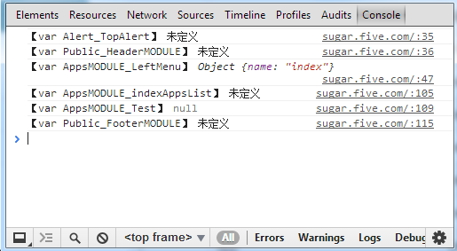

CHIJI Engine : Just Enjoy Front-end
======================================

- [CHIJI Engine : Just Enjoy Front-end](#chiji-engine--just-enjoy-front-end)
	- [OVERVIEW](#overview)
	- [Automatic Deployment for the Template files](#automatic-deployment-for-the-template-files)
		- [@todo](#todo)
		- [@module](#module)
	- [General Naming Specification](#general-naming-specification)
		- [页面结构类](#)
		- [导航类](#-1)
		- [表单](#-2)
		- [功能模块](#-3)
		- [状态](#-4)
	- [Accellerate the JS developing](#accellerate-the-js-developing)
	- [LESS Support](#less-support)

## OVERVIEW

Originally,it should be asserted that this engine just goals for accelerating the making of the template files. In another word, this is only a tool for building view quickly and easily.

There is no any altering for the view layer.

The key point of the CHIJI Engine's design is to make the deployment service oriented for the templates and front-end resources.

## Automatic Deployment for the Template files

CHIJI Engine goals for the basic deployment to simplify the arrangement in the view. Therefore developers could possess a series of files for front-end to be modified rather than to be making from the beginning.

### @todo

1. Make an empty template file matching up with the action address `Module/Action` .
2. Write down a string `@todo` in the file created just now without new lines.
3. Try to display this template in the browser and you will see the motivating result on the screen:

		欢迎使用千路前端

4. Return to the todo file just created, you will see all.

### @module

## General Naming Specification

### 页面结构类

描述         |下划线命名       |骆驼式命名      |参考命名
-------------|-----------------|----------------|----------------
面板         |dashboard        |                |
容器         |container        |container       | 
页头         |header           |header          |
内容         |content          |content         |container
外围控制     |wrapper          |wrapper         |wrap
页面主体     |main             |main            |
栏目         |column           |column          |
--宽栏目     |wide_column      |wideColumn      |
--窄栏目     |narrow_column    |narrowColumn    |
栏           |bar              |                |
侧边栏       |sidebar          |sidebar         |
网站地图     |sitemap          |                |
页尾         |footer           |footer          |

###导航类

描述                |下划线命名       |骆驼式命名      |参考命名
--------------------|-----------------|----------------|----------------
主导航              |nav_main         |navMain         |
--子导航            |nav_child        |navChild        |
--三级导航          |nav_third        |navThird        |
导航                |nav              |nav             |
--顶导航            |nav_top          |navTop          |
--左导航            |nav_left         |navLeft         |
--右导航            |nav_right        |navRight        |
复杂导航            |nav_group        |navGroup        |
--取消分隔线导航    |no_arrow         |noArrow         |
菜单                |menu             |menu            |
--子菜单            |menu_child       |menuChild       |submenu
位置导航            |crumb            |crumb           |
面包屑              |breadcrumb       |breadcrumb      |
                    |location-based   |                |
                    |attribute-based  |                |
                    |path-based       |                |
                    |breadcrumb

### 表单

描述                |下划线命名       |骆驼式命名      |参考命名
--------------------|-----------------|----------------|----------------
邮件                |mail             |                |
用户名              |username  
密码                |passwd
重复密码            |passwd_again
保存信息            |cookie
性别                |sex
地点                |local
下拉                |drop
验证码              |verification
按钮                |btn
必填项              |requisite
状态                |status

### 功能模块

描述                |下划线命名       |骆驼式命名      |参考命名
--------------------|-----------------|----------------|----------------
登录                |login            |
注册                |regsiter         |
搜索                |search           |
标签页              |tab              |
箭头                |arrow            |
首页                |first            |
上一页              |prev             |previous
下一页              |next             |
末页                |last
更早的              |older
更新的              |newer

### 状态

描述                |下划线命名       |骆驼式命名      |参考命名
--------------------|-----------------|----------------|----------------
列表                |list		
--热点              |hot
--更新              |new
前十列表            |topten_list
相关列表            |related_list
更新列表            |update_list

## Accellerate the JS developing

## DEBUG assigning via console

Since 1.7.8, developers could debug the viariables assigned from the controller straitforwardly under DEBUG MODE.

## LESS Support

[INDEX](#index)		
[CONTENTS](../README.md#contents)

## JS Support

### @require

RequireJS was embed and supported since 1.8.2, which means you are suggested to write javascript modularily and strengthen Chiji Modular Arrangement.

**FORMAT**: `//@require:backbone,jquery,underscore`